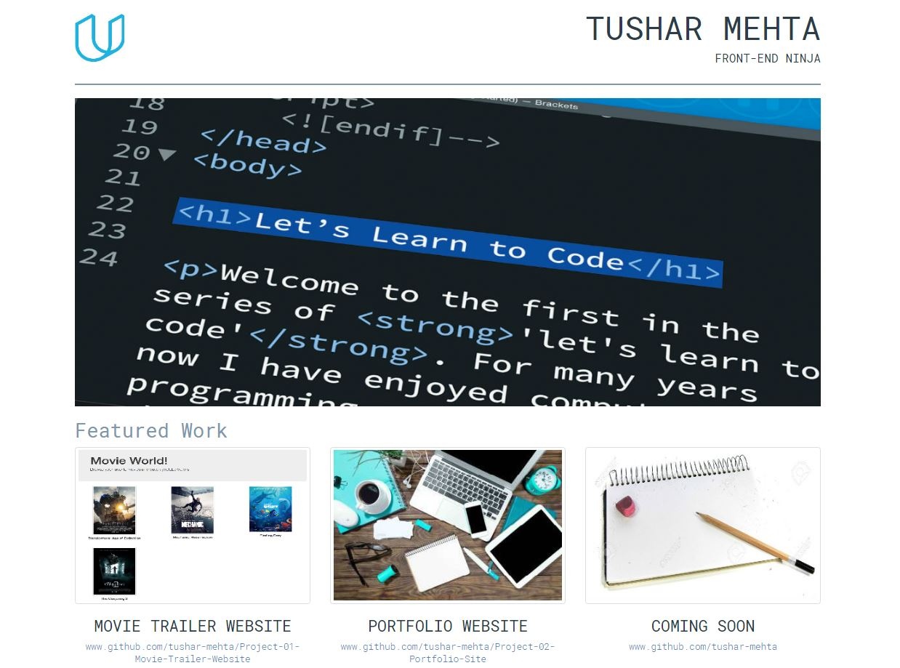

## Introduction
This is my portfolio website which is created as a part of **Full Stack Web Developer Nanodegree** program. This project focuses mainly on writing HTML, CSS files and creating responsive website. It showcase my projects on GitHub.
It generates a static web page allowing visitors to open projects on GitHub.

## Requirements
* web browser: any recent stable release of Safari/Chrome/Firefox

## Usage
Open `index.html` file in web browser.

## Details
* `index.html` files creates main structure of the website using a bootstrap framework.
* This HTML file was created based on box design principle.
* `style.css` contains specific style attribute to apply font style, color, and size.

## Demo

